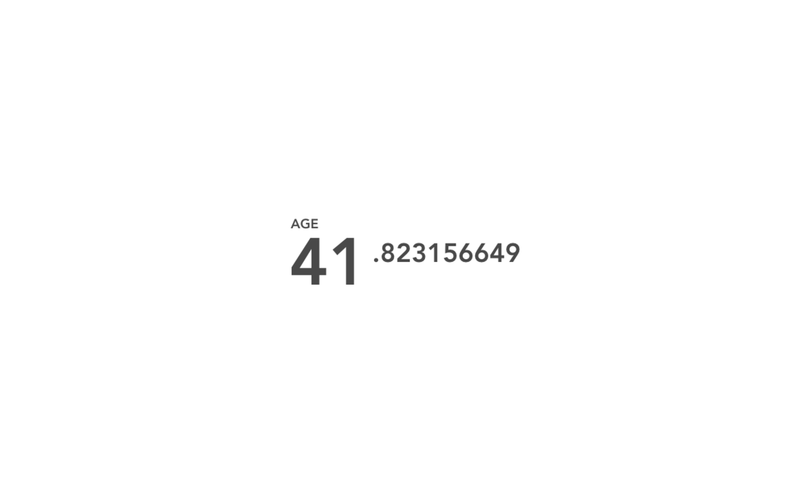

# Motivation Chrome Extension

A beautiful Chrome extension that replaces your new tab page with a motivation dashboard showing your age with millisecond precision.

**Forked from [maccman/motivation](https://github.com/maccman/motivation)**

## Original Author
- **maccman** - Original motivation extension

## Modifications by
- **Jonathan Goorin** - Enhanced with color customization features and Manifest V3 compatibility

## Features

- **New Tab Replacement**: Customizes your new tab page
- **Age Counter**: Shows your exact age with millisecond precision
- **Motivational**: Helps you realize how precious time is
- **Offline**: Works without internet connection
- **Privacy**: Stores your birth date locally only
- **Color Customization**: Customize background and text colors with persistent settings
- **Modern Design**: Clean, minimal interface with elegant color picker

## Installation

### Local Development
1. Clone this repository
2. Open Chrome and go to `chrome://extensions/`
3. Enable "Developer mode"
4. Click "Load unpacked" and select this directory
5. Open a new tab to see the extension in action

### Chrome Web Store
1. Visit the Chrome Web Store (when published)
2. Click "Add to Chrome"
3. Confirm the installation

## Usage

1. Enter your birth date when prompted
2. Click "Motivate"
3. Your age will be displayed with millisecond precision
4. The counter updates in real-time

## Development

- Built with vanilla JavaScript
- Uses native template literals for templating
- Manifest V3 compatible
- Responsive CSS design
- CSS custom properties for dynamic theming
- Local storage for persistent color preferences

## License

This project is open source and available under the MIT License.

